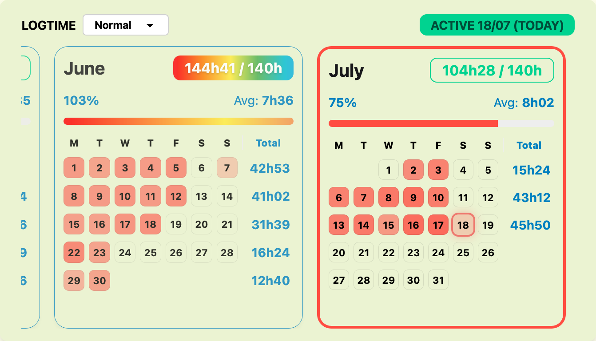
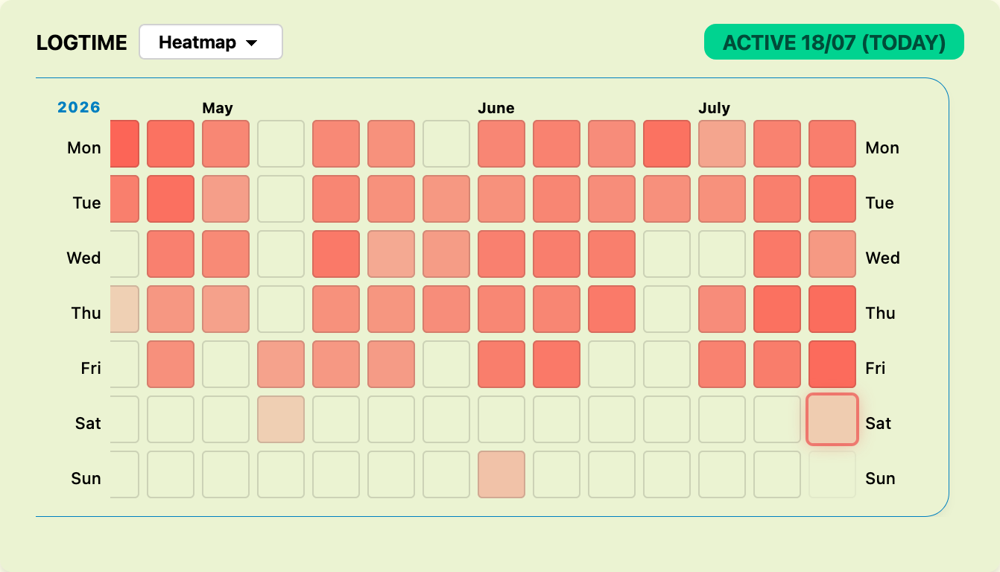
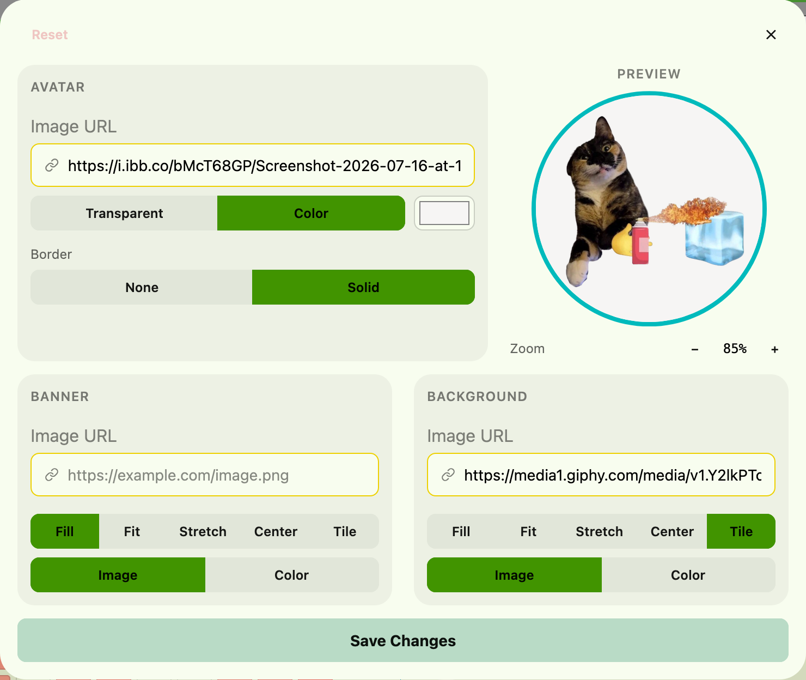
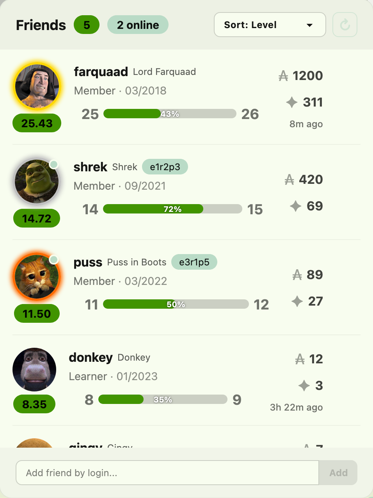

# Better Intra — 42 Mulhouse edition

Browser extension that improves the 42 Intra (v3 profile pages): logtime calendar, cluster map, custom profiles and looks, shortcuts, friends widget, correction stats, and a few secrets.

This is a fork of [nicopasla/better-intra](https://github.com/nicopasla/better-intra) (MIT), rebuilt for the **42 Mulhouse** campus and run on its own server. It keeps the upstream features that work without a 42 API application, reimplements the ones that used to need one on top of the Intra's own APIs, and adds a large customization layer. Nothing depends on the Belgium campus or on the upstream cloud any more.

---

## Install

Ready-made builds are attached to every [GitHub release](https://github.com/MaiToxx/BetterIntraRemake/releases/latest):

| File                      | For                                   |
| ------------------------- | ------------------------------------- |
| `better-intra.xpi`        | Firefox (signed by Mozilla)           |
| `better-intra-chrome.zip` | Chrome / Brave / Edge (unpacked)      |
| `better-intra.crx`        | Chrome on Linux (self-updating build) |

**Firefox** (the campus workstations): open the `.xpi` link, accept the install prompt. That's it: updates are automatic.

**Chrome / Brave / Edge on Windows or macOS**: unzip `better-intra-chrome.zip`, open `chrome://extensions`, enable *Developer mode*, *Load unpacked*, select the folder. Chrome cannot auto-update an unpacked extension: the toolbar icon shows a **NEW** badge when a release is out, and the popup links to it.

**Chrome on Linux**: drag `better-intra.crx` onto `chrome://extensions` (Developer mode on). This build updates itself.

Then open your profile on https://profile-v3.intra.42.fr, click the extension icon and **Connect with 42**: the extension signs you in with your current Intra session (no password, no OAuth page). Cloud features (settings sync, friends, shared visuals and looks) need this sign-in; everything else works without it.

### Updates

- **Firefox**: automatic, checked about once a day. *about:addons* → gear → *Check for Updates* forces it.
- **Chrome on Linux** (`.crx`): automatic through `updates.xml`.
- **Chrome on Windows/macOS**: only the Chrome Web Store can auto-update. The release workflow can publish there by itself once a developer account exists: see [docs/CHROME-WEB-STORE.md](docs/CHROME-WEB-STORE.md).
- Every build also checks GitHub every 6 hours and shows a **NEW** badge on the toolbar icon.

### Build it yourself

```bash
git clone https://github.com/MaiToxx/BetterIntraRemake.git
cd BetterIntraRemake
npm install
npm run build:chrome    # -> dist-chrome/
npm run build:firefox   # -> dist-firefox/
npm test
```

---

## How it works without a 42 API application

The upstream project needs a 42 OAuth application on its server. Pisciners cannot create one, so this fork signs in differently: the extension reads the Intra session token the v3 pages already use (a short-lived JWT issued by `auth.42.fr`), sends it to the fork's own Cloudflare Worker, which verifies the signature against 42's public keys and opens a session for that login. The token itself is never stored. Details in [docs/SELF-HOSTING.md](docs/SELF-HOSTING.md).

Data that upstream fetched through the 42 API is rebuilt from what the Intra already exposes to a logged-in student:

- friends' level, wallet, correction points, location and picture come from `intrapy.intra.42.fr`;
- correction statistics and Thursday Roulette history are parsed from the v2 Intra pages;
- cluster occupancy comes from `meta.intra.42.fr`.

The worker is deployed at `betterintra-remake.maitox.workers.dev`. Only that host and `*.intra.42.fr` are contacted.

---

## Features

> ☁️ marks features that need the 42 sign-in (cloud account).

### 👤 Profile

* **Custom visuals** — your own avatar, banner and background images (fill, fit, stretch, center, tile). Click your avatar on your profile to open the editor: zoom, drag to reposition, live preview. Link history keeps the last 10 URLs per field.
* **Avatar decoration** — transparent or solid colour behind the avatar, optional solid border.
* **Visuals sync ☁️** — other Better Intra users see your custom images on your profile. Click a custom avatar to see the original.
* **Instant visuals** — visuals are cached locally and refreshed silently.
* **Dashboard cards** — drag to reorder Logtime, Agenda, Evaluations, Projects, Achievements and Thursday Roulette; hide the ones you don't use.
* **Project badges** — projects as colour-coded badges (green normal, red exams).
* **Event filtering** — filter the agenda by campus and event type.
* **Sorted pending evaluations** — "To feedback", "Evaluator" and "Evaluated" sections with counts.
* **Achievements** — full scrollable list, newest first, with a glow on completed milestones.
* **Completed projects** — every graded project with date and score; multi-attempt projects expand; sort newest or oldest first.
* **Projects sort** — by name or date on any profile.
* **Freeze alerts** — a card with a live countdown on frozen students' profiles.
* **Clickable seat** — click someone's seat to open the cluster map with that seat highlighted.
* **Thursday Roulette ☁️** — the profile's roulette history and points, with a countdown to the next draw (rebuilt from the Intra pages).
* **Correction stats ☁️** — monthly evaluations as a corrector: total, failures, success rate (rebuilt from the Intra pages).
* **Moulinette robots** — the moulinette image on corrected pages becomes a robot (broken when failed).
* **Info card badges** — wallet, level, rank, score and seat as coloured badges under the header; the wallet badge opens the shop.
* **Campus flag** — the campus badge shows the country flag.
* **Nav bar avatar** — your custom avatar in the site navigation.
* **Phoenix / Pegasus tracker** — hover the badge for days and hours done vs required.

**Public profile ☁️** — a *Public profile* section at the end of the Profile tab. What you put there is shown to every Better Intra user who opens your page, and on your own page straight away:

* **Identity** — status with an emoji, pronouns, a 160-character bio, up to six flair emoji, and a greeting shown once to each visitor.
* **Links** — GitHub, GitLab, LinkedIn, a personal site (https only) and a Discord handle that visitors copy in one click.
* **Name** — accent or custom colour, two-colour gradient, animated rainbow, glow, neon, and six font choices.
* **Avatar frame** — solid, double, dashed, gradient, rainbow, glow or neon ring.
* **Level bar** — custom colour, gradient, rainbow or animated stripes.
* **Header & card** — one of the 13 gradients behind the header, a darkening slider, a blur behind the card, a permanent glow.
* **Effect** — snow, stars, fireflies, confetti, bubbles, sakura, rain or embers over the page, in three intensities, optionally tinted.

Only presentation values and short texts travel: never your custom CSS, fonts, size or any other setting. Everything you receive from someone else is validated again in your browser before it touches the page (strict colours, fixed lists of styles, https links rebuilt by the extension, text rendered as text), and the block is labelled as written by that student. Visitors who prefer plain profiles turn *Show other people's profile extras* off; the 🎨 badge hides a single profile's style for the current visit.

### 🎨 Customize

A **Customize** tab in the hub restyles every Intra page live, and syncs with your cloud settings.

* **Show your look to others ☁️** — *Publish my look on my profile* and every Better Intra user who opens your profile sees your accent, palette, background, card styles and per-card colours. A small badge says whose look it is, with a button to get your own style back for that visit. Fonts, size, density, scrollbar and custom CSS never leave your browser; every received value is validated before it touches the page. *Show other people's looks* turns it off on the viewer side.
* **Accent colour** — any colour for buttons, links, highlights and progress bars, with an optional two-colour gradient.
* **Colours** — your own page, card and text colours; borders, muted text and inputs are derived.
* **Background** — an image behind every page with a dark overlay and card opacity, or one of 13 built-in gradients (Aurora, Sunset, Ocean, Forest, Monochrome, Midnight, Candy, Lava, Nord, Dracula, 42 teal, Space, Mesh), optionally animated.
* **Cards** — flat, soft, strong, outlined, glass or accent-stripe cards; card opacity; avatar shape.
* **Dashboard cards** — frame every card with an accent or custom border, add a glow, colour the headings; then give each card (Agenda, Pending evaluations, Last achievements, Projects, Thursday roulette, Logtime) its own background, border and title colour.
* **Typography & layout** — system, humanist, rounded, serif, monospace or any font family; 70–140 % size; compact or comfortable density; rounded corners; scrollbar style; hide the footer.
* **Presets & theme codes** — save looks under a name, switch in one click, copy a theme code for a friend. Codes never carry custom CSS; a code that loads a background image asks first.
* **Custom CSS** — a free-form stylesheet applied last.
* **Themes** — dark / light and 30+ presets (synthwave, dracula, cyberpunk, nord, garden, cupcake…) for badges, sidebar and accents.
* **Easter eggs** — nine secrets hidden in the Intra; the About tab counts the ones you found. Off in Advanced if you prefer a quiet Intra.

### 📅 Logtime

* **Monthly calendar** with weekly totals, a **heatmap** view of the whole history and a **compact** view of past months.
* **Goal tracking** (default 140 h), daily average, last-active label, remaining hours on hover.
* **Emoji mode** — pick an emoji, give it a value, track monthly "earnings" with a cap.
* **Custom colours** and rainbow palettes; calendar events overlaid on the days.

### 📆 Calendar sync ☁️

The **Calendar** tab of the hub generates a private `.ics` link (with a QR code for phones) that Google Calendar, Apple Calendar or Outlook can subscribe to. Every time you open your own profile, the Intra events you are subscribed to are pushed to the worker, each with a 15-minute reminder. *Regenerate* revokes the old link at once, and so does wiping your cloud data.

### 🖥️ Clusters

* **Chair direction markers** on the cluster map, a **cluster picker**, a **default cluster**, open profiles in a new tab.
* **Live cluster map** (from the **Clusters** button in the Intra sidebar or the profile quick links): seat occupancy with avatars, taken/total badges, Wi-Fi tab, zoom, room tabs, campus selector and clock. The sidebar button shows up on every campus as soon as the extension has detected yours (it used to appear on the Belgium campus only). Mulhouse cluster data is in [campuses/mulhouse.json](campuses/mulhouse.json); other campuses are available too.

### 🔗 Shortcuts

Up to 8 quick links on the profile page with name, colour and emoji (or the site's icon), drag to reorder, optional hiding of the default links with left/center/right alignment.

### 👥 Friends ☁️

A panel in the bottom-right corner: add friends by login, see avatar, level, wallet, correction points, location and online status; follow/unfollow from any profile; sort by name, level, wallet, points or online; medal borders for the top 3; a badge with the number of friends online. Data refreshes every 3 minutes, or on demand.

### ☁️ Account

From the extension popup: connect with 42 (Intra session, no password), push/pull settings, auto-push, disconnect, wipe all cloud data.

### ⚡ Lighten the Intra

Four switches in the Advanced tab that make the **Intra page itself** cheaper, all on by default:

* **Skip off-screen blocks** — the browser stops laying out and painting the rows you have scrolled past in the long cards (projects, achievements, evaluations, logtime).
* **Load images when needed** — images the page mounts after the first paint are fetched lazily and decoded off the main thread.
* **Pause when the tab is hidden** — the page's animations and transitions stop while you are in another tab.
* **Connect early to the image server** — saves the connection setup on the first avatar, usually 100 to 300 ms.

The extension is also much lighter than it used to be. Its script went from 969 KB (1.9) to 576 KB, its popup from 335 KB to 40 KB, and a default-theme page parses 128 KB of CSS instead of 301 KB, once rather than once per widget. Settings are read from memory instead of one storage round trip each (about 50 reads down to 1 when a profile opens), and nothing polls in the background any more. Numbers and method in [docs/PERFORMANCE.md](docs/PERFORMANCE.md).

### ⚙️ Settings hub

The gear in the Intra sidebar opens the hub: Profile, Extras, Clusters, Logtime, Shortcuts, Calendar, Customize, Advanced, About. Feature toggles, per-feature reset, backup and restore (JSON), auto-detected campus, theme toggle, cloud status.

Everything the extension adds works from the keyboard and with a screen reader: the hub's tabs follow the arrow keys, every control has a name, and the avatar, the settings gear and the Clusters button are real buttons. The system's *reduce motion* setting, or **Disable animations** in Advanced, stills every animation the extension draws, easter eggs included.

### Not available in this edition

These upstream features cannot work on this fork's worker, so they were removed from the extension and their code no longer ships:

* **Discord evaluation reminders** — need a Discord bot and a 42 API token on the server.
* **Students directory** — the worker builds it with a 42 API application token, for the Belgium campus only.
* **⭐ Outstanding flag** — the worker reads it from the 42 API with a token that Intra sign-in sessions do not have.
* **Image upload to the worker** — needs an R2 bucket; use any image host and paste the URL instead.
* **Older logtime months** — "Load older months" reads the whole history through the 42 API, which also needs an application on the worker. The card stays hidden (its code is kept for workers that have one), and the calendar shows the months the Intra page itself loads.

The **transcript download** is still in the extension but only shows up on campuses whose campus file lists their transcript templates, which today is only Belgium ([campuses/belgium.json](campuses/belgium.json)). It needs no server: adding the Mulhouse records to [campuses/mulhouse.json](campuses/mulhouse.json) would be enough to turn it on.

---

## Screenshots









---

## Privacy

See [PRIVACY.md](./PRIVACY.md).

- Settings live in `chrome.storage.local`. Nothing leaves the browser until you connect with 42.
- With the cloud account, settings, friend logins, custom visuals and (if enabled) your public look are stored on the fork's worker under a hash of your login.
- Signing in sends your current Intra session token to the worker once, for verification. It is not stored.
- Other users' profiles: their public visuals and look are fetched from the worker when they use Better Intra.
- No analytics, tracking or advertising. Permissions: `storage`, `alarms`, `activeTab`, and access to `*.intra.42.fr`, the worker and `api.github.com` (update check).

## Self-hosting

The worker is a fork of the upstream one, at [MaiToxx/BetterIntraRemake-worker](https://github.com/MaiToxx/BetterIntraRemake-worker). Pointing the extension at another instance is a single setting (`package.json` → `config.workerUrl`): see [docs/SELF-HOSTING.md](docs/SELF-HOSTING.md).

## Development

See [DEVELOPMENT.md](./DEVELOPMENT.md). TypeScript, Vite, lit-html, Tailwind CSS + daisyUI, vitest; Cloudflare Workers, KV and D1 on the server side.

To release: bump `version` in `package.json`, push to `main`, publish a GitHub release tagged `v<version>`. The workflow builds both browsers, signs the Firefox build, attaches the files, updates `updates.json` / `updates.xml` and, once configured, publishes to the Chrome Web Store.

## Compatibility

| Browser | Support |
|:-------:|:-------:|
| Firefox |    ✅    |
| Chrome  |    ✅    |
|  Brave  |    ✅    |

## Disclaimer

Personal project, not affiliated with 42. It modifies the appearance of the Intra and can break when the Intra changes. Use at your own risk.

## Credits

Upstream project by [nicopasla](https://github.com/nicopasla/better-intra). Intra v2 dark mode from [Improved Intra](https://github.com/FreekBes/improved_intra). Icons from [Font Awesome](https://fontawesome.com/icons) and [Lucide](https://lucide.dev/); 42 logo and robot icons from Wikimedia Commons.

## License

[MIT](./LICENSE)
